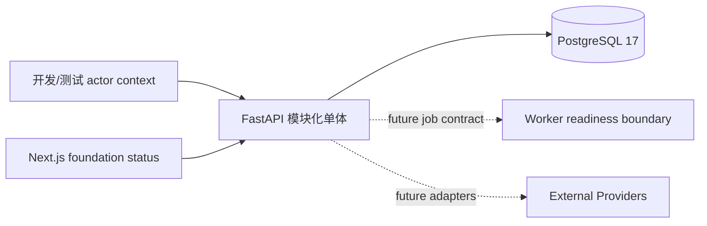

# 系统上下文

系统中心是“前期制作工作区”。Web 仍只展示 foundation status；FastAPI 模块化单体新增 Organization、Workspace、Membership、Project 与 AuditEvent persistence。Worker 保持零生产 handler。模型、文件存储、身份和导出目标仍是未接入的外部 Provider。

API 内部由 domain、application、infrastructure、presentation 四个小边界组成，仍是一个部署与事务边界，不是微服务。PostgreSQL 是单体持久化，不产生跨服务数据所有权或分布式事务。

## 冻结决定

服务端执行 tenant、membership、lifecycle、version 与 audit 策略；浏览器不直连 Provider。Project 与 AuditEvent mutation 在一个数据库事务中完成。

## 可替换假设与复审触发

FastAPI、SQLAlchemy、PostgreSQL 载体和部署拓扑可替换。达到工程宪法的单体拆分证据前，不增加服务间 RPC 或独立数据库。
