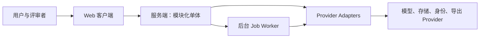

# 系统上下文

系统中心是“前期制作工作区”。用户和协作者通过未来 Web 客户端编辑制作蓝图；服务端的模块化单体执行领域规则、授权、版本与审计；Worker 执行长时任务。模型、文件存储、身份和导出目标都属于可替换的外部 Provider，只能通过服务端 Adapter 访问。

## 冻结决定

服务端是策略执行与 Provider 信任边界；浏览器不直连 Provider（[ADR-003](../adr/ADR-003-web-api-worker-separation.md)、[ADR-010](../adr/ADR-010-no-browser-provider-calls.md)）。

## 可替换假设与复审触发

Web、API、Worker 的具体框架与部署拓扑未选定。达到 [FOUNDATION.md](../../FOUNDATION.md) 的单体或 Job 复审指标时，再以 ADR 评估替换。
