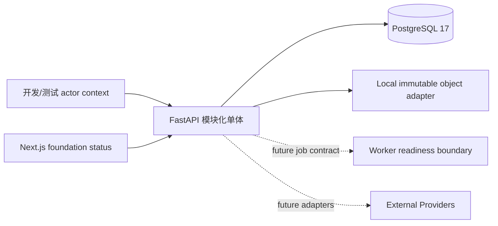

# 系统上下文

系统中心是“前期制作工作区”。Web 仍只展示 foundation status；FastAPI 模块化单体管理 tenant persistence、受控二进制/解析边界与离线 candidate validation。Worker 保持零生产 handler。local/test/ci 使用 StoragePort local adapter 和 deterministic fake model adapter；生产对象存储、真实模型、身份和导出目标仍未接入。

API 内部由 domain、application、infrastructure、presentation 四个小边界组成，仍是一个部署边界，不是微服务。PostgreSQL 是单体持久化；StoragePort 是外部资源边界，因此通过 stage/finalize/compensation 控制而非宣称分布式原子事务。

## 冻结决定

服务端执行 tenant、membership、lifecycle、version 与 audit 策略；浏览器不直连 Provider。Project 与 AuditEvent mutation 在一个数据库事务中完成。

## 可替换假设与复审触发

FastAPI、SQLAlchemy、PostgreSQL 载体和部署拓扑可替换。达到工程宪法的单体拆分证据前，不增加服务间 RPC 或独立数据库。
