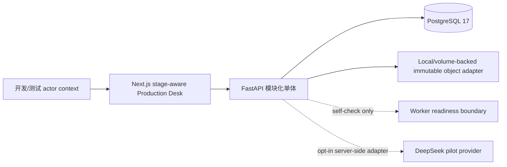

# 系统上下文

系统中心是“前期制作工作区”。Web 现在是一个 stage-aware Production Desk：它展示可读的
制作蓝图、阶段状态和 lineage，并把 Brief 候选接受、概念选择、分步产物生成以及 planning
bundle 审批保留为明确的 human gates。FastAPI 模块化单体管理 tenant persistence、受控二进制/解析
边界、审计和 Provider Adapter；deterministic offline provider 仍是默认。ADR-064 授权的
`deepseek-v4-flash` 仅作为 opt-in、server-side Provider adapter，浏览器不持有 Provider 凭据。
Worker 仍是 self-check-only readiness boundary，没有生产 handler。

```mermaid
flowchart LR
  U[开发/测试 actor context] --> W[Next.js stage-aware Production Desk]
  W --> A[FastAPI 模块化单体]
  A --> D[(PostgreSQL 17)]
  A --> S[Local/volume-backed immutable object adapter]
  A -. self-check only .-> J[Worker readiness boundary]
  A -. opt-in server-side adapter .-> P[DeepSeek pilot provider]
```

API 内部由 domain、application、infrastructure、presentation 四个小边界组成，仍是一个部署边界，不是
微服务。PostgreSQL 是单体持久化；StoragePort 是外部资源边界，因此通过 stage/finalize/compensation
控制而非宣称分布式原子事务。Local RC 使用本地 filesystem；私有 hosted pilot 使用 Compose volume，
云对象存储仍未接入。

## 冻结决定

服务端执行 tenant、membership、lifecycle、version、audit 与 human-gate 策略；浏览器不直连 Provider。
Project 与 AuditEvent mutation 在一个数据库事务中完成。Local RC、CI 与测试默认使用 deterministic
offline provider；ADR-064 的 DeepSeek adapter 必须显式 opt in，并保持 server-side。

## 可替换假设与复审触发

FastAPI、SQLAlchemy、PostgreSQL 载体和部署拓扑可替换。达到工程宪法的单体拆分证据、共享生产环境或
外部协作者访问、或 hosted pilot 的批准条件满足前，不增加服务间 RPC、独立数据库或多租户认证。
